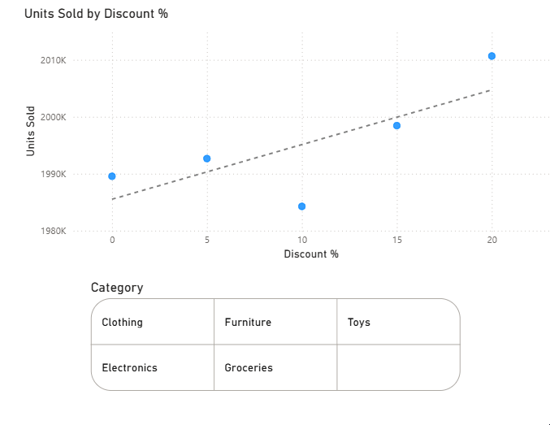
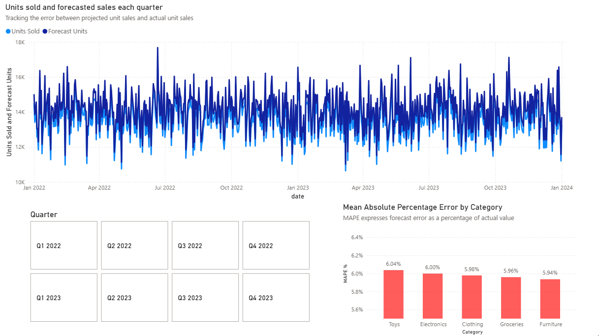

# Retail Inventory Warehouse & Dashboard (MS SQL + Power BI)

### Project Overview
End-to-end retail analytics pipeline built in **SQL Server** and visualised in **Power BI**.  

- **Data Engineering**
  - Raw CSV loaded into `stg.retail_store_inventory`.
  - Cleaned & typed staging table created for consistency.
  - Designed a **star schema**:  
    - `dim_date`, `dim_store`, `dim_product`  
    - `fact_inventory` holding transactional measures.  
  - Used `MERGE` to maintain dimension tables and populate the fact table with surrogate keys.
  - Exposed reporting view `mart.v_inventory_daily` for BI consumption.  

- **Analytics & Dashboarding**
  - Connected Power BI to SQL Server warehouse.
  - Built an interactive dashboard with KPIs and trend analysis.
  - Added slicers for **time period, category** to make insights explorable.  

---

## 🔹 1. Discount vs Units Sold
**Goal:** Measure price elasticity.  

- **Visual:** Scatter plot with regression line.  
- **X-Axis:** Discount %  
- **Y-Axis:** Units Sold  
- **Filter:** Category slicer  

**Insight:**  
Sales volumes generally **increase with higher discounts**, confirming customer price sensitivity.  
This can guide promotional strategies — discounts drive uptake, but should be balanced against margin.  

  

---

## 🔹 2. Forecast vs Actual Sales
**Goal:** Compare demand forecast accuracy.  

- **Visual:** Line chart with dual series.  
- **X-Axis:** Date (with quarter/relative period slicer)  
- **Y-Axis:** Units Sold vs Forecast Units  

**Insight:**  
Forecasts track broad trends well but show **quarterly variance**, particularly around seasonal peaks.  
Highlights the need to refine demand models or include external drivers (holidays, promotions, weather).  

  

---

## 🔹 3. Price Gap vs Units Sold
**Goal:** Understand competitive positioning.  

- **Visuals:**  
  - Line chart of **average price gap vs sales over time**  
  - Scatter plot of **average price gap vs units sold by quarter**  

- **X-Axis:** Price Gap (ours vs competitor)  
- **Y-Axis:** Units Sold  

**Insight:**  
When competitors price higher (positive gap), **our sales increase**.  
When we are more expensive (negative gap), sales fall.  
This provides clear evidence of **price sensitivity to competitor behaviour**, helping optimise pricing strategy.  

  

---

### Outcome
This project demonstrates:  
- **Data engineering**: staging, star schema, SQL `MERGE` logic.  
- **Data modelling**: fact/dimension separation for BI.  
- **Analytics & BI**: clear business insights (elasticity, forecast accuracy, competitive price gap).  
